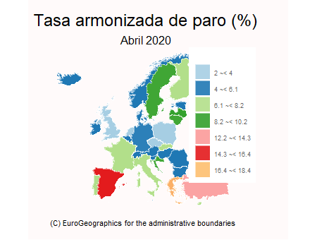

```{css, echo = FALSE}
body {background-color: darksalmon;}
```

```{r setup, include=FALSE}
knitr::opts_chunk$set(echo = TRUE, message = FALSE, warning = FALSE)
```

## INTRODUCCIÓN {.smaller}

> - Centraremos nuestro análisis principalmente en comentar los aspectos más importantes de **la Covid-19 a nivel mundial**. Seguidamente, destacaremos **algunos aspectos de la pandemia para España** y **por último centrado en la Comunidad Valenciana**. Finalizaremos con algunos **datos económicos.**

> - Pero primeramente... <FONT COLOR="FF4D00">**¿QUÉ ES EL CORONAVIRUS?**</FONT>

> - **Es una enfermedad infecciosa causada por un coronavirus recientemente descubierto**. Tuvo su **origen en la ciudad de Wuhan**, en China.

> - El primer caso diagnosticado fue el 17 de noviembre de 2019. Todo y que **se ha expandido rapidamente por todo el mundo.**


> - <center></center>

# Coronavirus en el MUNDO


```{r echo = FALSE, eval= TRUE}
#TIDY PARA EL "MUNDO".

library(rio)
library(tidyverse)

url_mundo <- "https://raw.githubusercontent.com/datasets/covid-19/master/data/time-series-19-covid-combined.csv"

df_mundo <- readr::read_csv(url_mundo)

df_mundo <- df_mundo %>% select(-"Province/State") %>%
            separate(Date, c("Año","Mes","Dia"), sep = "-")

df_mundo <- df_mundo  %>%
            relocate("Country/Region", .before=Año) %>%
            relocate(Año, .before=Confirmed)

df_mundo <- df_mundo %>%
            relocate(Mes, .after=Dia)

#A fecha del 01/12:

df_mundo_12 <- df_mundo %>% filter(Mes == "12" & Dia == "01")
df_mundo_12 <- df_mundo_12 %>% select(-Deaths)

#Para ver que hay países que se repiten y habrá que sumar todos los que se repiten:

df <- df_mundo_12 %>% group_by(`Country/Region`) %>% summarise(N = n())
#Países que se repiten: Australia, Canada, China, Denmark, France, Netherlands, United Kingdom.

df_b <- df_mundo_12 %>% filter(!(`Country/Region` %in% c("Australia", "Canada", "China", "Denmark", "France", "Netherlands", "United Kingdom")))


#Para Australia:
df_A <- df_mundo_12 %>% filter(`Country/Region` %in% "Australia")
df_cA <- df_A %>% mutate(Confirmed = sum(Confirmed))
df_cA <- df_cA %>% mutate(Recovered = sum(Recovered))
df_cA <- df_cA %>% slice(1)

#Para China:
df_C <- df_mundo_12 %>% filter(`Country/Region` %in% "China")
df_c <- df_C %>% mutate(Confirmed = sum(Confirmed))
df_c <- df_c %>% mutate(Recovered = sum(Recovered))
df_c <- df_c %>% slice(1)

#Para Denmark:
df_D <- df_mundo_12 %>% filter(`Country/Region` %in% "Denmark")
df_d <- df_D %>% mutate(Confirmed = sum(Confirmed))
df_d <- df_d %>% mutate(Recovered = sum(Recovered))
df_d <- df_d %>% slice(1)

#Para France:
df_F <- df_mundo_12 %>% filter(`Country/Region` %in% "France")
df_f <- df_F %>% mutate(Confirmed = sum(Confirmed))
df_f <- df_f %>% mutate(Recovered = sum(Recovered))
df_f <- df_f %>% slice(1)

#Para Netherlands:
df_N <- df_mundo_12 %>% filter(`Country/Region` %in% "Denmark")
df_n <- df_N %>% mutate(Confirmed = sum(Confirmed))
df_n <- df_n %>% mutate(Recovered = sum(Recovered))
df_n <- df_n %>% slice(1)

#Para United Kingdom:
df_U <- df_mundo_12 %>% filter(`Country/Region` %in% "Denmark")
df_u <- df_U %>% mutate(Confirmed = sum(Confirmed))
df_u <- df_u %>% mutate(Recovered = sum(Recovered))
df_u <- df_u %>% slice(1)


#Ahora tengo que juntar las tablas:
tabla <- bind_rows(df_b, df_u, df_n, df_f, df_d, df_c, df_cA)
```

```{r echo=FALSE, eval=TRUE}
df <- rio::import(here::here("datos", "tabla_mundo.csv"))

#Con esto podemos hacer unas tablas.

dfmax1 <- df %>% slice_max(Confirmed, n=1) #Estados Unidos es el país con más contagios.

dfmax2 <- df %>% slice_max(Recovered, n=1) #El máximo de recuperados está en India.

df_min1 <- df %>% slice_min(Confirmed, n=1) #El país con menos contagios es Vanuatu (es un país Oceania)
```

```{r echo=FALSE, eval=TRUE}
#TABLA PARA EL PAÍS CON MENOS CONATGIOS.

Imagen <- "http://banderasmundo.es/wp-content/uploads/2017/09/vanuatu.png"

df_min1 <- df_min1 %>% add_column(Imagen)
df_min1 <- df_min1 %>% select(-c(Dia, Mes, Año))

library(gt)
Tabla_Pmencotag <- df_min1 %>% gt()

Tabla_Pmencotag <- Tabla_Pmencotag %>%
                   tab_header(title = md("**País con menos contagios de Covid-19**"),subtitle = md("A fecha: 1/12/2020"))

Tabla_Pmencotag <- Tabla_Pmencotag %>%
                tab_options(heading.background.color = "coral") %>% tab_options(heading.title.font.size = 15, heading.subtitle.font.size = 13,  column_labels.font.weight =  "bold")


Tabla_Pmencotag <- Tabla_Pmencotag  %>%
  gt::text_transform(locations = cells_body(columns = vars(Imagen)), fn = function(x) {gt::web_image(x, height = 50)}) %>%  cols_align(
    align = "center")

#Lo mismo hacemos para las otras tres tablas
```

```{r echo=FALSE, eval=TRUE}

#TABLA PARA EL PAÍS CON MÁS CONTAGIOS:


ImagenUS <- "https://upload.wikimedia.org/wikipedia/commons/a/a4/Flag_of_the_United_States.svg"

dfmax1 <- dfmax1 %>% add_column(ImagenUS)
dfmax1 <- dfmax1 %>% select(-c(Dia, Mes, Año))

library(gt)
Tabla_Pmascotag <- dfmax1 %>% gt()

Tabla_Pmascotag <- Tabla_Pmascotag %>%
                   tab_header(title = md("**País con más contagios de Covid-19**"),subtitle = md("A fecha: 1/12/2020"))

Tabla_Pmascotag <- Tabla_Pmascotag %>%
                tab_options(heading.background.color = "coral") %>% tab_options(heading.title.font.size = 15, heading.subtitle.font.size = 13,  column_labels.font.weight =  "bold")


Tabla_Pmascotag <- Tabla_Pmascotag  %>%
  gt::text_transform(locations = cells_body(columns = vars(ImagenUS)), fn = function(x) {gt::web_image(x, height = 50)}) %>%  cols_align(
    align = "center")

#PAÍS CON MÁS RECUPERADOS DE COVID-19

ImagenI <- "https://www.banderas-mundo.es/data/flags/w580/in.png"

dfmax2 <- dfmax2 %>% add_column(ImagenI)
dfmax2 <- dfmax2 %>% select(-c(Dia, Mes, Año))


library(gt)
Tabla_Pmasrecu <- dfmax2 %>% gt()


Tabla_Pmasrecu <- Tabla_Pmasrecu %>%
                   tab_header(title = md("**País con más recuperados de Covid-19**"),subtitle = md("A fecha: 1/12/2020"))

Tabla_Pmasrecu <- Tabla_Pmasrecu %>%
                tab_options(heading.background.color = "coral") %>% tab_options(heading.title.font.size = 15, heading.subtitle.font.size = 13,  column_labels.font.weight =  "bold")


Tabla_Pmasrecu <- Tabla_Pmasrecu  %>%
  gt::text_transform(locations = cells_body(columns = vars(ImagenI)), fn = function(x) {gt::web_image(x, height = 50)}) %>%  cols_align(
    align = "center")
```

------
<br>
<center><FONT COLOR="Blue">**¿CUÁL ES EL PAÍS CON MÁS PERSONAS CONTAGIADAS?**</FONT></center>
<br>
```{r echo = FALSE, eval = TRUE}
Tabla_Pmascotag
```

<br>
<br>

<center><FONT COLOR="Blue">**¿EN QUÉ PAÍS HAY MÁS PERSONAS RECUPERADAS?**</FONT></center>
<br>
```{r echo = FALSE, eval = TRUE}
Tabla_Pmasrecu
```

------

<center><FONT COLOR="Blue">**¿CUÁL ES EL PAÍS CON MENOS CONTAGIOS?**</FONT></center>

<br>
```{r echo = FALSE, eval = TRUE}
Tabla_Pmencotag
```

<iframe src="https://www.europapress.es/internacional/noticia-isla-vanuatu-confirma-primer-caso-coronavirus-20201111101020.html" height="50" width="100"></iframe>

## EVOLUCIÓN 10 PAÍSES CON MÁS CONTAGIOS


```{r echo = FALSE, eval= TRUE}
#Gráfico con los 10 países que más casos de coronavirus presentan.
#Lo he sacado a partir de aquí: https://rpubs.com/JonathanRzezak/652633 !!!!

#remotes::install_github("kjhealy/covdata@main")

library(covdata)
library(tidyverse)
library(lubridate)
library(gganimate)
library(gifski)
library(RColorBrewer)

#install.packages("Cairo")
library(Cairo)

covid <- covnat %>%
  group_by(date) %>%
  arrange(date, desc(cu_cases)) %>%
  mutate(ranking = row_number()) %>%
  filter(ranking <= 10)

#De esta manera ha cambiado algunos nombres de la fila cname, también se podía haber hecho con la función case_when.

covid$cname <- gsub("Taiwan, Province of China", "Taiwan", covid$cname)
covid$cname <- gsub("Iran, Islamic Republic of", "Iran", covid$cname)
covid$cname <- gsub("Russian Federation", "Russia", covid$cname)
covid$cname <- gsub("Korea, Republic of", "South Korea", covid$cname)
covid$cname <- gsub("United Arab Emirates", "UAE", covid$cname)

#cu_cases son los casos acumulados.

#install.packages("RColorBrewer")
nb.cols <- 50
mycolors <- colorRampPalette(brewer.pal(12, "Paired"))(nb.cols)
```

```{r echo=FALSE, eval=TRUE}
a <- ggplot(covid)+
  geom_col(aes(ranking,cu_cases,fill=cname))+
  scale_fill_manual(values=mycolors)+
  geom_text(aes(ranking,cu_cases,label=as.factor(cu_cases)),hjust=-0.1,size=5)+
  geom_text(aes(ranking, y=0 , label = cname), hjust=1.1,size=5) +
  geom_text(aes(x=10, y=max(cu_cases) , label = as.factor(date)), vjust = 0, hjust=1, alpha = 0.1,  col = "black", size = 20)+
  labs(title = "Evolución de los casos positivos de Covid-19 en el mundo",
       subtitle = "Datos de la Universidad Johns Hopkins",
       x=NULL,
       y=NULL)+
  coord_flip(clip = "off")+
  scale_x_reverse()+
  theme_minimal()+
  theme(legend.position = "none",
        axis.title.y = element_blank(),
        axis.title.x = element_blank(),
        axis.text.y = element_blank(),
        axis.text.x = element_blank(),
        plot.title = element_text(hjust = 0, size=20,face="bold"),
        plot.subtitle = element_text(hjust = 0, size=12, face="italic"),
        plot.margin = margin(1, 4, 1, 3, "cm"))+
  transition_states(date,transition_length = 1,state_length = 0,wrap = FALSE)
```

```{r echo=FALSE, eval = TRUE, out.width="90%"}
 animate(a,
        nframes = 800,
        fps = 24,
        end_pause = 200,
        width = 1000,
        height = 600,
        type = "cairo")
```

------
<center><FONT COLOR="FF4D00">¿Cómo hemos hecho el anterior gráfico?</FONT></center>

<br>
<br>

- Paquetes usados: **Tidyverse**, para arreglar los datos, **ggplot2**, **gganimate** y **gifski** para agregar la animación, **RColorBrewer** para la paleta de colores, y  **COVDATA** !! (para obtener los datos)

- Hemos arreglado el df, cogiendo los casos acumulados. Además, hemos hecho un ranking en una columna nueva, y con  los 10 países que presentan un número mayor de contagios.

- Hemos realizado un gráfico de barras (con geom_col) y para que esté animado se ha utilizado la función `transition_states` (del paquete gganimate)

- Por último la función **animate** donde ponemos los fotogramas por segundo, el tiempo de pausa (cuando acaba la transición), etc. 

```{r echo=TRUE, eval = FALSE}
 animate(a,
        nframes = 800,
        fps = 24,
        end_pause = 200,
        width = 1000,
        height = 600,
        type = "cairo")
```


## Representando la curva de contagios 
Para Estados Unidos, Portugal, Nigeria y Japón. (Ojo, con las ESCALAS)

```{r US, echo = FALSE,eval=TRUE}
#Gráfico para US:
df_mundoUS<- df_mundo %>% filter(`Country/Region` == "US") %>% select(-c(Recovered, Deaths))

df_mundoUSS <- df_mundoUS %>% summarise(dif = diff(Confirmed))

dfUS <- df_mundoUS %>% select(`Country/Region`,Dia, Mes)
dfUS <- dfUS %>% slice(-1)
US <- bind_cols(dfUS, df_mundoUSS)

US <- US %>% mutate(ranking = row_number())

graficoUS <- ggplot(US, aes(ranking, dif, color = Mes)) + geom_line() + labs(title = "EEUU",  x = NULL, y = "Nº casos al día") +  theme_bw() + theme(axis.text.x=element_blank(), axis.ticks.x=element_blank())  +  theme(plot.title = element_text(hjust = 0.5)) +  theme(legend.position = "none")

#Ibamos ha hacerlo también de Australia, pero no lo he hecho porque el número de casos es bastante bajo y la diferencia entre un día y otro sale negativa. (Por lo que el gráfico no se ve bien)

#Mismo proceso para Nigeria, Japón y Portugal
#Por tanto, pongo el código para que no se vea. (echo=FALSE)
```


```{r Nigeria,  echo=FALSE, eval=TRUE}

#Para Nigeria:

df_mundoN<- df_mundo %>% filter(`Country/Region` == "Nigeria") %>% select(-c(Recovered, Deaths))

df_mundoNN <- df_mundoN %>% summarise(dif = diff(Confirmed))

dfN <- df_mundoN %>% select(`Country/Region`,Dia, Mes)
dfN <- dfN %>% slice(-1)
N <- bind_cols(dfN, df_mundoNN)

N <- N %>% mutate(ranking = row_number())

graficoN <- ggplot(N, aes(ranking, dif, color = Mes)) + geom_line() + labs(title = "Nigeria", x = NULL, y = "Nº casos al día") +  theme_bw() + theme(axis.text.x=element_blank(), axis.ticks.x=element_blank())  +  theme(plot.title = element_text(hjust = 0.5)) +  theme(legend.position = "none")

```


```{r Japón, echo=FALSE, eval=TRUE}

#Para Japón

df_mundoJ<- df_mundo %>% filter(`Country/Region` == "Japan") %>% select(-c(Recovered, Deaths))

df_mundoJJ <- df_mundoJ %>% summarise(dif = diff(Confirmed))

dfJ <- df_mundoJ %>% select(`Country/Region`,Dia, Mes)
dfJ <- dfJ %>% slice(-1)
J <- bind_cols(dfJ, df_mundoJJ)

J <- J %>% mutate(ranking = row_number())

graficoJ <- ggplot(J, aes(ranking, dif, color = Mes)) + geom_line() + labs(title = "Japón",  x = NULL, y = "Nº casos al día") +  theme_bw() + theme(axis.text.x=element_blank(), axis.ticks.x=element_blank())  +  theme(plot.title = element_text(hjust = 0.5)) + theme(legend.position = "none")
```

```{r Portugal, echo = FALSE,eval=TRUE}
#Para Portugal

df_mundoP<- df_mundo %>% filter(`Country/Region` == "Portugal") %>% select(-c(Recovered, Deaths))

df_mundoPP <- df_mundoP %>% summarise(dif = diff(Confirmed))

dfP <- df_mundoP %>% select(`Country/Region`,Dia, Mes)
dfP <- dfP %>% slice(-1)
P <- bind_cols(dfP, df_mundoPP)

P <- P %>% mutate(ranking = row_number())

graficoP <- ggplot(P, aes(ranking, dif, color = Mes)) + geom_line() + labs(title = "Portugal",  x = NULL, y = "Nº casos al día") +  theme_bw() + theme(axis.text.x=element_blank(), axis.ticks.x=element_blank())  +  theme(plot.title = element_text(hjust = 0.5))+  theme(legend.position = "none")
```


```{r echo=FALSE, eval = TRUE,  out.width="79%", out.height="19%" }
library(patchwork)
(graficoUS + graficoP) / (graficoJ + graficoN)
```

## Muertes a nivel global {.flexbox .vcenter}

```{r echo=FALSE, eval=TRUE}
library(tidyverse)

#Para la tabla de muertes_dia hacemos, separamos por día y mes. Y filtrar las fechas hasta des de las primeras disponibles hasta el 31 de octubre.

library(lubridate)

muertes_dia <- rio::import(here::here("datos", "muertes_dia.xlsx"))

muertes_dia <- muertes_dia %>% mutate(Dia= day(Date)) %>% mutate(Mes= month(Date))  %>%
filter(!Mes == "11")  %>% select(!Date)

muertes_dia <- muertes_dia %>% mutate(Mes = case_when(
  Mes == 1 ~ "Enero",
  Mes == 2 ~ "Febrero",
  Mes == 3 ~ "Marzo",
  Mes == 4 ~ "Abril",
  Mes == 5 ~ "Mayo",
  Mes == 6 ~ "Junio",
  Mes == 7 ~ "Julio",
  Mes == 8 ~ "Agosto",
  Mes == 9 ~ "Septiembre",
  Mes == 10 ~ "Octubre",
))

muertes_dia$facet = factor(muertes_dia$Mes, levels = c("Enero","Febrero","Marzo", "Abril","Mayo","Junio","Julio","Agosto","Septiembre","Octubre"))

library(gganimate)
library(plotly)

graficoM <- ggplot(muertes_dia , aes(Dia , Daily_Deaths,  color= Mes))  + geom_line() + labs(title = "Evolución de muertes al día en el mundo por Covid", subtitle = "Desde el 24 de Enero hasta el 31 de Octubre", caption = "Datos repositorio COVID19", x = "Muertes diarias", x = "Dias") +  theme(legend.position = "none") + scale_x_continuous(breaks = seq(1, 30, 5)) + facet_wrap(~facet, nrow = 4, ncol = 3)  + transition_reveal(Dia)

```

```{r echo=FALSE, eval=TRUE, out.width="95%"}
graficoM
```

## Un mapa de los fallecidos, del paquete **TIDYCOVID19** {.flexbox .vcenter}

```{r echo=FALSE, eval=TRUE}
library(tidycovid19)
merged <- download_merged_data(cached = TRUE, silent = TRUE)

mapaCD <- map_covid19(
  data = download_merged_data(cached = TRUE, silent = TRUE),
  type = "deaths",
  cumulative = FALSE,
  change_ave = 7,
  per_capita = TRUE)

library(ggplot2)
mapaCD <- mapaCD + labs(title = "COVID-19",
                        subtitle = "Muestra la variación diaria de muertes por 100.000 habitantes (promedio durante 7 dias)", caption = "Datos del día 07/12/2020,  
Datos obtenindos de Johns Hopkins University CSSE Github Repo: https://github.com/joachim-gassen/tidycovid19.") +
  theme(plot.title = element_text(hjust = 0.5)) +  
  theme(plot.subtitle = element_text(hjust = 0.5))
```

```{r eval = TRUE, echo = FALSE}
mapaCD + scale_fill_viridis_c(direction = -1)
```


# Coronavirus en **ESPAÑA** 

## Contagios, teniendo en cuenta la POBLACIÓN de cada província {.flexbox .vcenter}

```{r echo=FALSE, eval=TRUE}
library(tidyverse)

df_prov <- rio::import(here::here("datos", "datos_provincias.csv"))

df_prov <- df_prov %>% separate(fecha, c("dia","mes","año"), sep = "--")

df_prov <- df_prov %>% select(provincia_iso, provincia, dia, mes, año, num_casos)

library(rio)

rio::export(df_prov, here::here("datos", "datos_provinciasok.csv"))

df <- rio::import(here::here("datos", "datos_provinciasok.csv"))

dfg <- df %>% select(-provincia_iso) %>% select(-año)

dfhab <- rio::import(here::here("datos", "excel_hab_prov.xlsx"))

tabla <- full_join(dfg, dfhab, by = c("provincia" = "Provincia"))

dfgg <- tabla %>% group_by(provincia, mes, Poblacion) %>% summarise(Num = sum(num_casos))

dfgg <- dfgg %>% select(provincia, Poblacion, mes, Num)


dfrel <- dfgg %>% mutate(Total_cap = (Num/Poblacion))

```

```{r echo=FALSE, eval=TRUE}
dfT <- dfgg %>% group_by(provincia, Poblacion) %>% summarise(Total = sum(mes, Num))

dfTrel <- dfT %>% mutate(Totalxcap = (Total/Poblacion))

#unique(dfTrel$provincia)
dfTrel$provincia <- gsub("Santa Cruz de Tenerife", "Tenerife",dfTrel$provincia)

rio::export(dfTrel, here::here("datos", "dfTrel.csv"))
dfTrelp <- dfTrel %>% mutate(Porcentaje = Totalxcap*100)

```

```{r echo=FALSE, eval=TRUE}
library(treemapify)

Tremp <- ggplot(dfTrelp, aes(area = Porcentaje, fill = Porcentaje, label = provincia)) +
  geom_treemap() +
  geom_treemap_text(fontface = "italic", colour = "white", place = "centre",
                    grow = FALSE) +
  scale_fill_viridis_c(option = "inferno", name = "", alpha = 0.8, begin = 0.3, end = 0.7, direction = -1,
                       guide = guide_colorbar( title = "% casos según población", direction = "horizontal", barheight = unit(2, units = "mm"),
                                               barwidth = unit(50, units = "mm"), draw.ulim = F,
                                               title.position = 'top', title.hjust = 0.5, label.hjust = 0.5)) +
  theme(legend.position = "bottom") + scale_x_continuous(labels=function(n){format(n, scientific = FALSE)}) +
  labs(title = "Provincias con mayor número de casos según su población (en %)",
       subtitle = "Se ha calculado el Total de casos entre la pobación y multiplicado por 100 para sacar el porcentaje",
       caption = "Los últimos datos corresponden al 11-11-2020") + theme(plot.title = element_text(hjust = 0.5)) +
  theme(plot.subtitle = element_text(hjust = 0.5))
```

```{r echo=FALSE, eval=TRUE}
Tremp
```

## Evolución PCR's según CCAA {.flexbox .vcenter}

```{r echo=FALSE, eval=TRUE, fig.align = "center"}
dfp <- rio::import(here::here("datos", "datos_pruebas.xlsx"))

dfa <-dfp %>%
  separate(Fecha, c("año","mes","dia"), sep = "-") %>%                 relocate(año, .after=dia) %>%
  relocate(dia, .before =mes) %>% select(!OTROS_TESTS) %>% select(!OTROS_TESTS_x_1000hab.)

dfCCAA <- dfa %>% filter(CCAA != "España")

#Exporto los datos para poder empezar el análisis desde aquí.
#rio::export(dfCCAA, here::here("datos", "dfCCAA.csv"))
dfCCAA <- rio::import(here::here("datos", "dfCCAA.csv"))

dfCCAA <- dfCCAA %>% select(!CCAA)
dfCCAA <- dfCCAA %>% mutate(CCAA = case_when(
  cod_ine == 1 ~ "Andalucia",
  cod_ine == 2 ~ "Aragon",
  cod_ine == 3 ~ "Asturias",
  cod_ine == 4 ~ "I.Baleares",
  cod_ine == 5 ~ "Canarias",
  cod_ine == 6 ~ "Cantabria",
  cod_ine == 7 ~ "Castilla Leon",
  cod_ine == 8 ~ "Castilla La Mancha",
  cod_ine == 9 ~ "Cataluña",
  cod_ine == 10 ~ "C.Valenciana",
  cod_ine == 11 ~ "Extremadura",
  cod_ine == 12 ~ "Galicia",
  cod_ine == 13 ~ "Madrid",
  cod_ine == 14 ~ "Murcia",
  cod_ine == 15 ~ "Navarra",
  cod_ine == 16 ~ "Pais Vasco",
  cod_ine == 17 ~ "La Rioja",
  cod_ine == 18 ~ "Ceuta",
  cod_ine == 19 ~ "Melilla",
)) %>% relocate(CCAA, .after=cod_ine)

#Grafico de PCR's por cada mil habitantes:

PruebasP <- ggplot(dfCCAA, aes(mes, PCR_x_1000hab., fill = CCAA)) + geom_col(position = "dodge")

PCRs <- PruebasP +  facet_wrap(vars(CCAA)) + labs(x = "Mes", y = "Núm. pruebas PCR", title = "PCR's al mes por cada mil hab.", caption = "Datos obtenidos de Datadista")  + theme_bw() + scale_y_continuous(labels=function(n){format(n, scientific = FALSE)}) + theme(legend.position = "none") + theme(plot.title = element_text(hjust = 0.5))


library(wordcloud2)

dfCCAAp <- dfCCAA %>% select(dia, mes, CCAA, PCR_x_1000hab.) %>% filter(dia == "5") %>% filter(mes == "11") %>% arrange(desc(PCR_x_1000hab.))
dfCCAAp <- dfCCAAp %>% select(CCAA, PCR_x_1000hab.)

w <- wordcloud2(data = dfCCAAp, size = 0.4)

```


PCR's por cada 1000 habitantes

```{r echo=FALSE, eval=TRUE}
PCRs 
```

## Evolución PCR's según CCAA {.flexbox .vcenter}

```{r echo=FALSE, eval=TRUE}
w
```


# Coronavirus en la **Comunidad Valenciana** 

## Evolución contagios (Enero-Noviembre) {.flexbox .vcenter}

```{r echo=FALSE, eval=TRUE, out.width="75%"}
library(tidyverse)

df_prov <- rio::import(here::here("datos", "datos_provincias.csv"))

df_prov <- df_prov %>% separate(fecha, c("dia","mes","año"), sep = "--")

df_prov <- df_prov %>% select(provincia_iso, provincia, dia, mes, año, num_casos)

library(rio)

rio::export(df_prov, here::here("datos", "datos_provinciasok.csv"))

df <- rio::import(here::here("datos", "datos_provinciasok.csv"))

dfg <- df %>% select(-provincia_iso) %>% select(-año)

dfhab <- rio::import(here::here("datos", "excel_hab_prov.xlsx"))

tabla <- full_join(dfg, dfhab, by = c("provincia" = "Provincia"))

dfgg <- tabla %>% group_by(provincia, mes, Poblacion) %>% summarise(Num = sum(num_casos))

dfgg <- dfgg %>% select(provincia, Poblacion, mes, Num)


dfrelb <- dfgg %>% mutate(Total_cap = (Num/Poblacion))

dfTrelx <- dfrelb %>% mutate(Totalxcap = (Total_cap*100)) %>% filter(provincia %in% c("Castellon", "Valencia", "Alicante"))

dfTrelx <- transform(dfTrelx, mes = as.numeric(mes))

a <- ggplot(data = dfTrelx, aes(mes, Num, group=provincia, color = provincia)) + geom_line() + geom_point() + theme_minimal()   + labs(y= "Número de contagios", y = "Meses", caption = "Elaboración propia") + theme(plot.title = element_text(hjust = 0.5)) + scale_x_continuous(breaks = seq(1, 11, 1))

a + transition_reveal(mes) + labs(title="NÚMERO DE CASOS EN LA COMUNIDAD VALENCIANA. Mes: {as.integer(frame_along)}")
```


## Tipos de pruebas realizadas {.flexbox .vcenter}
En los meses de **Julio, Agosto** y **Septiembre**

```{r echo=FALSE, eval=TRUE}
cv <- dfp %>% filter(CCAA == "Comunidad Valenciana")
cv  <- cv %>%
  separate(Fecha, c("año","mes","dia"), sep = "-") %>%                 relocate(año, .after=dia) %>%
  relocate(dia, .before =mes)


cv <- cv %>% filter (mes == "07"| mes == "08"| mes == "09") %>% select(dia, mes, PCR, TEST_ANTICUERPOS, OTROS_TESTS)

cvl <- cv %>% pivot_longer(3:5, names_to = "Pruebas", values_to = "N.prueba")

#Para calcular en la Comunidad Valenciana que tipo de pruebas se han hecho más durante los meses de julio, agosto y septiembre.

Csep <- cvl %>% group_by(mes, Pruebas) %>% summarise(Total = sum(N.prueba)) %>% filter(mes == "09")

S <- ggplot(Csep, aes("", Total, fill = Pruebas)) + geom_bar(stat = "identity", color="white") + geom_text(aes(label=Total), position = position_stack(vjust=0.5), color = "white", size = 2) + coord_polar(theta = "y") + scale_fill_manual(values=c("Green","Blue","Red")) + theme_void() + labs(title="septiembre") + theme(plot.title = element_text(hjust = 0.5))
#Igual para julio y agosto
```

```{r echo=FALSE, eval=TRUE}

Cjul <- cvl %>% group_by(mes, Pruebas) %>% summarise(Total = sum(N.prueba)) %>% filter(mes == "07")

J <- ggplot(Cjul, aes("", Total, fill = Pruebas)) + geom_bar(stat = "identity", color="white") + geom_text(aes(label=Total), position = position_stack(vjust=0.5), color = "white", size = 2) + coord_polar(theta = "y") + scale_fill_manual(values=c("Green","Blue","Red")) + theme_void() + labs(title="julio") + theme(plot.title = element_text(hjust = 0.5)) + theme(legend.position = "none")

Cagost <- cvl %>% group_by(mes, Pruebas) %>% summarise(Total = sum(N.prueba)) %>% filter(mes == "08")

A <- ggplot(Cagost, aes("", Total, fill = Pruebas)) + geom_bar(stat = "identity", color="white") + geom_text(aes(label=Total), position = position_stack(vjust=0.5), color = "white", size = 2) + coord_polar(theta = "y") + scale_fill_manual(values=c("Green","Blue","Red")) + theme_void() + labs(title="agosto") + theme(plot.title = element_text(hjust = 0.5)) + theme(legend.position = "none")
```

```{r echo=FALSE, eval=TRUE, out.width="80%"}
library(patchwork)
J +  A + S
```

## Evolución de los ingresados (Sept-Nov) {.flexbox .vcenter}

```{r echo=FALSE, eval=TRUE}
urla <-"https://raw.githubusercontent.com/datadista/datasets/master/COVID%2019/ccaa_ingresos_camas_convencionales_uci.csv"
aaa <- rio::import(urla)

#Hay que tener en cuenta que la variable % Camas Ocupadas UCI Covid no tiene datos hasta el 21-09-2020 por lo tanto para analizar la segunda OLA si que nos sirve pero no para la primera
library(tidyverse)
library(gganimate)

datos_CCAA <- aaa %>%
  separate(Fecha, c("Año","Mes","Dia"), sep = "-") %>%
  select(-CCAA) %>% mutate(CCAA = case_when(
  cod_ine == 0 ~ "España",
  cod_ine == 1 ~ "Andalucia",
  cod_ine == 2 ~ "Aragon",
  cod_ine == 3 ~ "Asturias",
  cod_ine == 4 ~ "Islas Baleares",
  cod_ine == 5 ~ "Canarias",
  cod_ine == 6 ~ "Cantabria",
  cod_ine == 7 ~ "Castilla Leon",
  cod_ine == 8 ~ "Castilla La Mancha",
  cod_ine == 9 ~ "Cataluña",
  cod_ine == 10 ~ "Com.Valenciana",
  cod_ine == 11 ~ "Extremadura",
  cod_ine == 12 ~ "Galicia",
  cod_ine == 13 ~ "Madrid",
  cod_ine == 14 ~ "Murcia",
  cod_ine == 15 ~ "Navarra",
  cod_ine == 16 ~ "Pais Vasco",
  cod_ine == 17 ~ "La Rioja",
  cod_ine == 18 ~ "Ceuta",
  cod_ine == 19 ~ "Melilla",
)) %>% relocate(CCAA, .after=cod_ine)

datos_CCAA <- datos_CCAA %>% rename("Ingresos Ult.24h" = "Ingresos COVID últimas 24 h") %>% rename("Altas Ult24h" = "Altas COVID últimas 24 h")

datos_CV <- datos_CCAA %>%
  filter(cod_ine == 10) %>%
  relocate(cod_ine, .before=Dia) #Datos para la Comunitat Valenciana

datos_CV_S_N<- datos_CV %>% filter (Mes == "09"| Mes == "10"| Mes == "11")

grafico_CV <- ggplot(datos_CV_S_N , aes(Dia , `Total Pacientes COVID ingresados`, group=Mes, color= Mes))  + geom_line() + labs(title = " Evolución de pacientes ingresados por covid en la Comunidad Valenciana", subtitle = "Desde el 1 Septiembre hasta Noviembre 30", caption = "Datos repositorio COVID19") 

```

```{r echo=FALSE, eval=TRUE, out.width="80%"}
 grafico_CV
```


# Algunos datos económicos....

## DESEMPLEO {.flexbox .vcenter}
En este caso, vamos a mostrar un mapa con los países de la Unión Europea, con el fin de ver cual era el % de paro armonizado en el mes de **abril** (plena pandemia)

```{r echo=FALSE, eval=TRUE}
library(eurostat)

mapdata_0 <- get_eurostat_geospatial(nuts_level = 0)
m <- mapdata_0 %>%
  ggplot(., aes()) +
  geom_sf(fill="green", color="black", size = 0.1) +
  theme_minimal() +
  xlim(c(-30, 44)) +
  ylim(c(35, 75))

#PREPARANDO LOS DATOS
paro <- search_eurostat(pattern = "unemployment",
                             type = "table")

#Hay datos hasta 2020M11, es decir, hasta el mes de noviembre de este año, 2020.

inf_paro <- get_eurostat(id= "teilm020",  time_format = "num")

labelE <- label_eurostat(inf_paro)

country_codes <- unique(mapdata_0$NUTS_ID)

#2020.25 corresponde al año 2020 mes 04 (abril)
inf_paro_2020 <- inf_paro %>%
  filter( time == "2020.25") %>%
  filter(geo %in% country_codes)

inf_paro_2020_mapa <- mapdata_0 %>%
  right_join(inf_paro_2020) %>%
  mutate(cat = cut_to_classes(values, n=8, decimals = 1))
```

```{r echo = FALSE, eval=TRUE}
#CODIGO PARA EL MAPA

a <- ggplot(inf_paro_2020_mapa, aes(fill=cat)) +
  geom_sf(color = alpha("white", 1/2), alpha= .9) +
  xlim(c(-20, 44)) +
  ylim(c(35, 70)) +
  labs(title = "Tasa armonizada de paro (%)",
       subtitle = "Abril 2020",
       caption = "(C) EuroGeographics for the administrative boundaries",
       fill= "") +
  theme_classic() +
  theme(
    axis.line = element_blank(),
    axis.text = element_blank(),
    axis.title = element_blank(),
    axis.ticks = element_blank(),
    plot.background = element_rect(fill = "snow", color = NA),
    panel.background = element_rect(fill= "snow", color = NA),
    plot.title = element_text(size = 18, hjust = 0.5),
    plot.subtitle = element_text(size = 12, hjust = 0.5),
    plot.caption = element_text(size = 8, hjust = 1),
    legend.title = element_text(color = "grey40", size = 8),
    legend.text = element_text(color = "grey40", size = 7, hjust = 0),
    legend.position = c(0.93, 0.6),
    plot.margin = unit(c(0.5,2,0.5,1), "cm")) +
  scale_fill_brewer(palette= "Paired")
```

<div class="columns-2">

  

<br>
¿**CÓMO HEMOS HECHO EL MAPA**?

...Fácil! 
Los datos son del <FONT COLOR="blue">paquete: **Eurostat**</FONT>

- Con la función: **`get_eurostat_geospatial`**
- Usando `right_join` para unir los 2 df, en uno estaban los datos que necesitabamos, en el otro la geometría.
- Por útimo, el paquete **`ggplot`** y la función **`geom_sf`** para hacer el mapa. 
  
</div>

## PIB {.flexbox .vcenter}
Aclaración: Los datos van desde el primer trimestre del 2018 hasta el tercero del 2020. (Cada punto del gráfico representa un trimestre)

```{r echo=FALSE, eval=TRUE}
#Datos del paquete Eurostat:
library(tidyverse)

library(eurostat)

gdp <- get_eurostat("namq_10_gdp", time_format = "raw", keepFlags = TRUE)

labelgdp <- label_eurostat(gdp, fix_duplicated = TRUE)
df_names <- names(gdp)

df <- label_eurostat(gdp, code = df_names, fix_duplicated = TRUE)

df <- df %>%
    select(unit_code, s_adj_code, na_item_code, geo, geo_code, time, values)

#df_bb <- pjpv2020.01::pjp_f_unique_values(df, truncate = TRUE, nn_truncate = 200)

df <- df %>% filter(time >= "2018Q1")
gdp <- df


gdp<- gdp %>% rename (unidad_de_medida =na_item_code)

# a) Gross domestic product at market prices
gdp_a <-  gdp  %>% filter(unidad_de_medida== "B1GQ") %>% select(-unidad_de_medida)

gdp_a <- gdp_a %>% filter(unit_code == "CLV_I15") %>% filter(s_adj_code == "SCA")

gdp_a <- gdp_a %>% select(-c(unit_code,s_adj_code))


#b)Export of goods and services.
gdp_b <- gdp  %>% filter(unidad_de_medida== "P6") %>% filter(unit_code == "CLV_I15") %>% filter(s_adj_code == "SCA")

gdp_b <- gdp_b %>% select(-c(unit_code,s_adj_code))
gdp_b <- gdp_b %>% select(-unidad_de_medida)

#c)Imports of good and services.

gdp_c <-  gdp  %>% filter(unidad_de_medida== "P7") %>% filter(unit_code == "CLV_I15") %>% filter(s_adj_code == "SCA")

gdp_c <- gdp_c %>% select(-c(unit_code,s_adj_code))
gdp_c <- gdp_c %>% select(-unidad_de_medida)

#d)Gross fixed capital formation
gdp_d<- gdp  %>% filter(unidad_de_medida== "P51G") %>% filter(s_adj_code == "SCA") %>% filter(unit_code == "CLV_I15")

gdp_d <- gdp_d %>% select(-c(unit_code,s_adj_code))
gdp_d <- gdp_d %>% select(-unidad_de_medida)


#seleccionamos Francia Italia España y SUecia

gdp_pa<- gdp_a %>%  filter (geo=="Italy"|geo=="Sweden"|geo=="France"|geo=="Spain" )
gdp_pb<- gdp_b %>%  filter (geo=="Italy"|geo=="Sweden"|geo=="France"|geo=="Spain" )
gdp_pc<- gdp_c %>%  filter (geo=="Italy"|geo=="Sweden"|geo=="France"|geo=="Spain" )


library(plotly)

Evgdpa <- ggplot(gdp_pa, aes(time, values,group=geo, color = geo)) + geom_line(size = 1) + geom_point() + labs(y = "Valor (en %)", title = "Ev. del PIB a precios de mercado (% en base al año 2015)") +
    theme_light() +
    theme(plot.title = element_text(size = 18, hjust = 0.5),
          plot.subtitle = element_text(size = 12, hjust = 0.5),
          plot.caption = element_text(size = 8, hjust = 1)) +
    theme(axis.title.x=element_blank(),
          axis.text.x=element_blank())


Evgdpb <- ggplot(gdp_pb, aes(time, values,group=geo, color = geo)) + geom_line(size = 1) + geom_point() + labs(y = "Valor (en %)", title = "Ev. X de bienes y servicios (% en base al año 2015)") +
    theme_light() +
    theme(plot.title = element_text(size = 18, hjust = 0.5),
          plot.subtitle = element_text(size = 12, hjust = 0.5),
          plot.caption = element_text(size = 8, hjust = 1)) +
    theme(axis.title.x=element_blank(),
          axis.text.x=element_blank())

Evgdpc <- ggplot(gdp_pa, aes(time, values,group=geo, color = geo)) + geom_line(size = 1) + geom_point() + labs(y = "Valor (en %)", title = "Evol. M de bienes y servicios (% en base al año 2015)", caption ="Datos Eurostat") +
    theme_light() +
    theme(plot.title = element_text(size = 18, hjust = 0.5),
          plot.subtitle = element_text(size = 12, hjust = 0.5),
          plot.caption = element_text(size = 8, hjust = 1)) +
    theme(axis.title.x=element_blank(),
          axis.text.x=element_blank())

library(gridExtra)  #- install.packages("gridExtra")

```


```{r echo=FALSE, eval=TRUE}
grid.arrange(Evgdpa, Evgdpb,Evgdpc, nrow= 3)
```

# Y esto es todo!

## Alguna duda??

<center></center>

<br>

- Si quieres ver el trabajo completo, puedes hacerlo dándole click <a href="https://nosan5.github.io/trabajo_BigData_equipo/" target="_blank">aquí</a>

- O puedes ver la repo en: <a href="https://github.com/nosan5/trabajo_BigData_equipo
" target="_blank">Github</a>


## Bibliografía

- <https://www.r-bloggers.com/2020/03/meet-tidycovid19-yet-another-covid-19-related-r-package/>
- <https://towardsdatascience.com/create-a-word-cloud-with-r-bde3e7422e8a>
- <https://rpubs.com/JonathanRzezak/652633>
- <https://www.diegocalvo.es/ejemplo-de-grafico-de-lineas-en-r/>
- <https://bookdown.org/yihui/rmarkdown/shiny-widgets.html#example-k-means-clustering>
-<https://rpubs.com/jaortega/153805>
- <https://es.stackoverflow.com/questions/387750/c%C3%B3mo-cambiar-la-visualizaci%C3%B3n-de-un-grafico-en-r-markdown>
- <https://perezp44.github.io/intro-ds-20-21-web/04-tutoriales.html>
- <https://datosmacro.expansion.com/otros/coronavirus/vanuatu>
- <https://r4ds.had.co.nz/graphics-for-communication.html#figure-sizing>
- <https://www.rdocumentation.org/>

(La bibliografía completa se puede ver en el <a href="https://nosan5.github.io/trabajo_BigData_equipo/" target="_blank">informe</a>)
